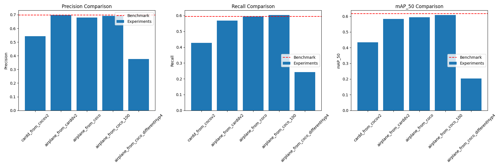

**Disclaimer:** I intend to write my master's thesis on ~~"Aircraft Region Detection using Deep Learning."~~ However, I am uncertain whether the dataset will be ready by the deadline required for this course. This will become clear shortly. Therefore, I have outlined an alternative plan below, which involves selecting a different project type. My preferred choice is Topic 1; if that is not feasible, I will pursue Topic 2 instead.

**Disclaimer 2:** This worked out now at intended. My Master Thesis topic got shifted which is what i have to do now. Unfortunately this was known only very late which is why i had to change things during the project. 

# Aircraft ~~Region~~ **Defect** Detection using Deep Learning

## Results:

| Experiment                          | Precision   | Recall   | mAP_50  | mAP_50_95 |
|-------------------------------------|-------------|----------|---------|-----------|
| cardd_from_cocov2                   | 0.54377     | 0.42670  | 0.43352 | 0.203440  |
| airplane_from_carddv2               | 0.69687     | 0.56812  | 0.58389 | 0.266890  |
| airplane_from_coco                  | 0.68002     | 0.59495  | 0.59403 | 0.276570  |
| airplane_from_coco_100              | 0.69185     | 0.60262  | 0.60725 | 0.287960  |
| airplane_from_coco_differentHyp4    | 0.37695     | 0.24280  | 0.20318 | 0.077559  |
| **Benchmark**                       | **0.698**   | **0.594**| **0.617**|           |




## 0. Setup:
a) **Environment Setup**
Install dependencies:
```bash
pip install -r requirements.txt
```

b) **Preprocessing the Data**
Run the preprocessing pipeline (COCO filtering and VOC to YOLO conversion):
```bash
python main.py --preprocess --config config.json
```
- To run specific preprocessing steps:
  - **Filter COCO Data**:
    ```bash
    python main.py --operation filter --config config.json
    ```
  - **Convert VOC to YOLO**:
    ```bash
    python main.py --operation convert --config config.json
    ```

c) **Training the Model**
Run YOLOv5 training using **Approach A** (Direct Transfer) or **Approach B** (Intermediate Transfer):

- **Approach A**: COCO → Airplane
   ```bash
   python training/train.py
   ```

- **Approach B**: COCO → CarDD → Airplane
   ```bash
   python training/train.py --approach_b
   ```

Or use the **shell script** for automation:
```bash
bash training/training_commands.sh A    # Approach A
bash training/training_commands.sh B    # Approach B
```

d) **Running Inference & Evaluate Performance**
After training, test the model and then validate. The command will be dependable on your model weights


## 1. References to scientific papers:
a) Deep Learning for Scene Classification: A Survey by  Zeng et. al.
b) Scene classification with Convolutional Neural Networks King, Kishore, Ranalli

## 2. Topic:
Aircraft ~~Region~~ **Defect** Detection using Deep Learning 

## 3. Project Type:
~~Bring your own data~~

## 4. Written Summary: 

### a) Short description of project idea and approach:
I have a machine learning task where I want to detect damages on aircraft. To achieve this, I used the YOLOv5 model with the COCO weights (pretrained) and fine-tuned it using my aircraft defect dataset.

Additionally, I explored transfer learning using data from a different domain, specifically a car damage detection dataset. For this pretraining, I used YOLOv5 with COCO weights instead of random weights and then fine-tuned it on my aircraft data.

Ultimately transfer learning did not yield the expected results and it did not improve my models performance. 

By training solely on my aircraft data set got the following results compared to the benchmark:

- Precision: The model achieved 0.69185, which is slightly below the benchmark precision of 0.698. The difference is minor, showing that the model's precision is very close to the benchmark.

- Recall: The model achieved 0.60262, which is higher than the benchmark recall of 0.594. This indicates that the model captures slightly more positive instances compared to the benchmark.

- mAP_50: The model achieved 0.60725, which is slightly below the benchmark 0.617. The difference is minor, showing that the model's mean Average Precision at IoU 50 is nearly on par with the benchmark.


### b) Description of the dataset:

The car damage dataset contained many irrelevant classes (e.g., broken windows, scratches) that do not pertain to my aircraft damage detection task, I filtered out unnecessary annotations and corresponding images. The original data was in VOC format, but YOLOv5 requires a specific format, so I converted the data accordingly.
After preprocessing i had two datasets (one for the car for transfer learning and one for aircraft) which had each two classes (cracks, dents)

Short Information about CarDD link: https://cardd-ustc.github.io/
CarDD: The CarDD dataset, created by Xinkuang Wang, et. al. is a scale dataset designed specifically for vision-based car damage detection and segmentation. It consists of:

- 4,000 high-resolution images (tough that is with all categories of which i used only 2) and Over 9,000 well-annotated instances
- Six damage categories, such as scratches, dents, and broken windows (i only used cracks and dents since it matched with my other data set)


Aircraft Damage Detection 2
The Aircraft Damage Detection 2 dataset, hosted on Roboflow and created by Youssef Donia, focuses on identifying damage types in aircraft. The dataset contains:

- 4,169 images
- Two classes: Cracks, Dents: 

Link: https://universe.roboflow.com/youssef-donia-fhktl/aircraft-damage-detection-2


~~### a) Short description of project idea and approach:~~
~~The project aims to develop a deep learning-based system for detecting and classifying different regions of an aircraft to support visual inspections. The approach will involve: ~~

~~- Collecting a dataset of aircraft images from various angles and regions~~
~~- Developing a convolutional neural network (CNN) or Vision Transformer for region classification~~
~~- Evaluating the model's performance on a test set~~

~~### b) Description of the dataset:~~
~~The dataset will consist of high-resolution images of various aircraft regions, including: ~~

~~- Fuselage sections~~
~~- Wings (leading edge, trailing edge, winglets)~~
~~- Empennage (vertical and horizontal stabilizers)~~
~~- Landing gear~~
~~- Engine nacelles and pylons~~

~~Images will be collected from multiple aircraft types to ensure diversity. Each image will be labeled with the corresponding region classification. The goal is to collect enough pictures so that the prediction is reliable ~~

### c) Work-breakdown structure with time estimates: 

1. **Dataset Collection and Preparation (4 weeks) (Oct 21 – 17 Nov)**
   - Coordinate with Professor about access to the pictures (14 days)
   - Organize and label images (13 days)
   - Preprocess and augment data (2 days)

2. **Network Design and Implementation (2 weeks) (18 Nov – 1 Dez)**
   - Research and select appropriate CNN architecture (3 days)
   - Implement chosen architecture using PyTorch (4 days)
   - Set up data pipeline and training environment (3 days)

3. **Model Training and Fine-tuning (2 weeks) (2 Dez – 15 Dez)**
   - Initial model training (5 days)
   - Hyperparameter tuning and optimization (5 days)
   - Validation and testing (4 days)

4. **Performance Evaluation and Analysis (1 week) (12 Dez-17 Dez)**
   - Conduct comprehensive evaluation on test set (3 days)
   - Analyze results and generate performance metrics (2 days)

*Christmas Break*

5. **Application Development and Integration (27 Dez – 12 Jan):**
   - Build a small application to run the model (14 days)
   - Prepare deliverables (2 days)

6. **Showcase Application and Finalize Presentation (13 Jan – Jan 21):**
   - Any other leftover things (3 days)
   - Make the presentation (3 days)


~~# Plan B~~
~~# Vision Transformer for Scene Classification using AID Dataset~~

~~## 1. References to Scientific Papers~~
~~- **a)** "An Image is Worth 16x16 Words: Transformers for Image Recognition at Scale" by Dosovitskiy et al. (2021)~~
~~- **b)** "Image Classification Based on Vision Transformer" by Scirp Journal (2023)~~

~~## 2. Topic~~
~~**Scene Classification using Vision Transformer (ViT) on the AID (Aerial Image Dataset) dataset**~~

~~## 3. Project Type~~
~~**Bring your own method**~~

~~## 4. Written Summary~~

~~### a) Short Description of Project Idea and Approach~~
~~This project aims to implement a Vision Transformer (ViT) model for scene classification using the AID dataset. The approach will involve:~~
~~- Adapting the ViT architecture for scene classification tasks~~
~~- Training the ViT model on the AID dataset~~
~~- Comparing the performance of the ViT model with traditional CNN approaches~~
~~- Analyzing the model's attention mechanisms for interpretability~~

~~### b) Description of the Dataset~~
~~The AID dataset is a large-scale aerial image dataset for scene classification. It contains:~~
~~- 10,000 aerial images~~
~~- 30 scene classes (e.g., airport, bare land, beach, bridge, commercial, desert)~~
~~- Images with a fixed size of 600x600 pixels~~
~~- High intra-class variations and small inter-class dissimilarities~~

~~### c) Work-Breakdown Structure with Time Estimates~~
~~- **Dataset Preparation and Exploration (2 weeks)** (Oct 22 - Nov 4)~~
~~  - Download and organize the AID dataset (4 days)~~
~~  - Perform exploratory data analysis (5 days)~~
~~  - Preprocess and augment data (5 days)~~

~~- **ViT Model Design and Implementation (2 weeks)** (Nov 5 - Nov 18)~~
~~  - Study ViT architecture and adapt for scene classification (5 days)~~
~~  - Implement ViT model using PyTorch or TensorFlow (6 days)~~
~~  - Set up data pipeline and training environment (3 days)~~

~~- **Model Training and Optimization (2 weeks)** (Nov 19 - Dec 2)~~
~~  - Initial model training (5 days)~~
~~  - Hyperparameter tuning and optimization (5 days)~~
~~  - Validation and testing (4 days)~~

~~- **Performance Evaluation and Comparison (1 week)** (Dec 3 - Dec 9)~~
~~  - Evaluate ViT model on test set (2 days)~~
~~  - Compare with CNN baselines (2 days)~~
~~  - Analyze attention mechanisms for interpretability (3 days)~~

~~- **Application Development and Integration (2 weeks)** (Dec 10 - Dec 23)~~
~~  - Develop a simple web or desktop application to demonstrate the model (8 days)~~
~~  - Integrate the trained ViT model into the application (6 days)~~

~~**Christmas Break**~~

~~- **Documentation and Reporting (1 week)** (Jan 2 - Jan 8)~~
  ~~- Write a comprehensive report on the methodology and results (4 days)~~
  ~~- Prepare a presentation summarizing the project (3 days)~~

~~- **Final Review and Submission (2 weeks)** (Jan 9 - Jan 22)~~
~~  - Review and refine all deliverables (8 days)v~~
~~  - Prepare for final submission (6 days)~~
